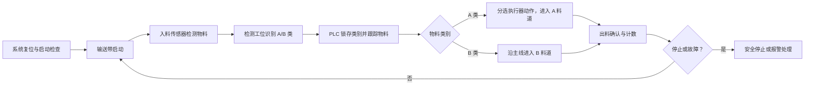

# PLC-Sorting-System 项目当前状态记录

| 文档属性 | 内容 |
|---|---|
| 文档编号 | PSS-STATUS-001 |
| 文档版本 | V2.0 |
| 更新日期 | 2026-07-17 |
| 当前阶段 | 阶段 3：PLC程序实现与PLCSIM仿真（开发中） |
| 前一阶段 | 阶段 2：系统详细设计（已完成） |
| 文档用途 | 长期记录项目基线、技术方案、阶段状态与文件规划 |

> 本文档是项目状态入口。每次阶段切换、关键技术决策或项目范围变化后均应更新，并在项目日志中保留对应变更记录。

## 项目基本信息

### 项目名称

**PLC-Sorting-System**

### 项目目标

设计并仿真实现一个基于 PLC 的智能分选系统，模拟工业生产中的物料检测、输送、分类、执行机构控制、报警处理和 HMI 监控过程；采用接近真实工业项目的需求、设计、编程、仿真、测试和版本管理流程，最终形成可复现、可演示、可扩展的自动化工程案例。

### 项目定位

- 个人工业自动化学习与技术展示项目。
- 当前无实体 PLC、传感器和执行机构，不进行真实接线及现场调试。
- 优先采用学校课程常用的西门子自动化生态。
- 重点展示工业控制需求分析、平台选型、系统架构、I/O 设计、PLC 程序结构、HMI、报警诊断和仿真测试能力。
- 后期可扩展 Python 数据分析与 AI 辅助设备分析，但不让 AI 参与急停或安全联锁控制。

## 已完成工作

| 编号 | 工作项 | 完成内容 | 状态 |
|---|---|---|---|
| C-001 | GitHub 仓库建立 | 创建 `PLC-Sorting-System` 仓库，完成本地 clone 与远程同步 | 已完成 |
| C-002 | Git 环境配置 | 安装 Git，配置用户信息，理解基本版本管理流程 | 已完成 |
| C-003 | VS Code 环境配置 | 安装 Visual Studio Code，连接 Git，并可通过 `code .` 打开项目 | 已完成 |
| C-004 | Git 流程实践 | 完成 README 修改、`git add`、`git commit` 和 `git push` | 已完成 |
| C-005 | 项目管理体系 | 建立 Work 项目、路线图、日志和设计资料结构 | 已完成 |
| C-006 | PLC 平台选型 | 对比 Siemens S7-1200 与 S7-1500，确定 S7-1200 为主平台 | 已完成 |
| C-007 | 系统需求分析 | 完成项目定位、系统范围、运行模式、控制功能、HMI 和验收需求 | 已完成 |
| C-008 | 总体技术路线 | 确定 TIA Portal、S7-PLCSIM、WinCC HMI 仿真及 Python 扩展路线 | 已完成 |
| C-009 | 系统总体架构设计 | 完成 PLC、HMI、仿真、Python 与 AI 五层架构及接口边界设计 | 已完成 |
| C-010 | I/O 点表设计 | 完成 14DI、6DO、仿真/HMI 接口、变量命名及 TIA Portal 表结构设计 | 已完成 |
| C-011 | 状态机、报警与程序结构规划 | 完成九状态控制流程、18项报警及OB/FB/DB职责规划 | 已完成 |
| C-012 | WinCC HMI设计 | 完成画面结构、权限、交互规范及PLC/HMI变量接口设计 | 已完成 |
| C-013 | 阶段2综合评审与收口 | 完成需求追溯、FAT规范、阶段总结及阶段3门禁定义 | 已完成 |
| C-014 | 项目目录结构规划 | 完成docs、PLC、HMI、Simulation、Python及版本管理目录规划 | 已完成 |
| C-015 | 最终仓库结构基线 | 完成现有文档迁移映射和TIA/WinCC唯一主工程归档规则 | 已完成 |
| C-016 | 阶段3暂停记录 | 记录暑假实验室不可用、暂停范围、恢复条件和开学后流程 | 已完成 |
| C-017 | TIA Portal V21环境 | 完成V21安装、环境配置及现有TIA项目创建 | 已完成 |
| C-018 | S7-1200硬件配置 | 完成CPU 1214C DC/DC/DC设备添加、组态和参数配置 | 已完成 |
| C-019 | 基础PLC逻辑 | 完成首批变量、OB1启停自锁逻辑并通过0错误0警告编译 | 已完成 |

阶段 1 的正式成果：

- [PLC 智能分选系统需求分析](../02-系统设计/PLC智能分选系统需求分析.md)
- [西门子 PLC 平台选型报告](../02-系统设计/西门子PLC平台选型报告.md)
- [项目整体技术路线](项目整体技术路线.md)

## 当前技术方案

### PLC 型号

| 项目 | 当前决定 |
|---|---|
| PLC 品牌 | Siemens |
| PLC 系列 | SIMATIC S7-1200 |
| 实际CPU型号 | CPU 1214C DC/DC/DC |
| 具体订货号/固件 | 待从V21项目设备属性中补充记录 |
| 备选/扩展平台 | S7-1500，用于后期平台迁移或高级功能扩展 |

选择 S7-1200 的原因是：系统规模属于小型独立自动化单元；平台与学校课程一致；能够完整支持结构化 PLC 程序、HMI、报警、诊断和软件仿真；其学习与工程复杂度适合个人项目。

### 软件环境

| 软件/工具 | 用途 | 当前状态 |
|---|---|---|
| TIA Portal | 硬件组态、PLC 与 HMI 一体化工程管理 | V21已安装并完成项目配置 |
| STEP 7 | S7-1200 PLC 程序开发 | V21工程功能已用于OB1开发和编译 |
| S7-PLCSIM | 虚拟 PLC 下载、在线监控及 I/O 仿真 | 尚未配置和验证 |
| WinCC HMI Runtime/仿真 | 操作、状态、报警、参数和统计画面 | 尚未配置 |
| Visual Studio Code | 文档、脚本及 Git 管理 | 可正常使用 |
| Git / GitHub | 版本管理与项目展示 | 可正常使用 |
| Python | 后续数据清洗、统计与可视化 | 规划阶段 |

兼容性原则：TIA Portal、目标 CPU 固件、S7-PLCSIM 和 WinCC 组件应使用相互兼容的版本，并优先与学校现有环境保持一致。

### 仿真方案

项目采用纯软件仿真，分四级逐步实施：

1. **I/O 单点仿真：** 手动改变输入信号，验证启停、模式、传感器、执行器和报警响应。
2. **设备行为仿真：** 通过 PLC 仿真模块生成输送带和分选执行器反馈，并支持故障注入。
3. **自动物料仿真：** 自动生成 A/B 类物料及各工位传感器信号，重复执行分选循环。
4. **FAT 场景测试：** 验证正常循环、手动调试、正常停止、急停、传感器异常、动作超时和恢复流程。

HMI 负责运行操作、工艺动画、参数设置、报警和统计；独立仿真面板仅用于产生虚拟输入和故障场景。

安全边界：项目中的急停为功能逻辑仿真，不代表真实机器安全功能。实体设备需要独立风险评估及符合要求的安全硬件和验证流程。

### 工艺流程

初版范围为一条输送线、一个检测工位、一个分选工位、A/B 两类物料和一个分选执行器。



主要运行模式包括自动运行、手动调试和停止；急停与关键故障可从任意运行步骤切换到故障锁定状态。

## 当前阶段

### 阶段 1：需求分析与平台选型——已完成

完成内容：

- 项目应用场景、目标和工程边界已明确。
- 系统整体流程、自动/手动、启停、急停、检测、分类、执行机构、报警和 HMI 需求已定义。
- Siemens S7-1200 与 S7-1500 已完成比较。
- 已推荐 S7-1200 作为初版主平台。
- 纯软件 PLC/HMI 仿真和后续数据扩展路线已形成。

阶段结论：需求和平台方案可以作为详细设计输入。具体 CPU 型号、软件版本、I/O 地址、程序接口和报警参数将在阶段 2 锁定。

### 当前状态

项目已完成 **阶段 2：系统详细设计**，并于2026-07-17恢复阶段3实际开发。TIA Portal V21已安装，现有项目`PLC_Sorting_System_V21`已创建，CPU 1214C DC/DC/DC硬件配置、首批变量和OB1启停自锁逻辑已完成，编译结果为0错误、0警告。

### 阶段3恢复与开发状态

- **原暂停日期：** 2026-07-13。
- **恢复日期：** 2026-07-17。
- **实际软件基线：** TIA Portal V21。
- **TIA项目名称：** `PLC_Sorting_System_V21`。
- **硬件：** SIMATIC S7-1200 CPU 1214C DC/DC/DC。
- **已实现：** OB1启动—停止自锁基础逻辑。
- **编译结果：** 0错误、0警告。
- **尚未验证：** PLCSIM下载、RUN/STOP和逻辑动作。
- **尚未配置：** WinCC环境。

### 当前PLC变量与实现状态

| 变量 | 地址 | 用途 | 当前状态 |
|---|---|---|---|
| `Start_Button` | `%I0.0` | 启动按钮 | 已使用 |
| `Stop_Button` | `%I0.1` | 停止按钮 | 已使用 |
| `System_Run` | `%M0.0` | 自锁运行状态 | OB1已实现 |
| `Motor_Output` | `%Q0.0` | 传送带电机输出 | 已预留，尚未实现控制 |

### 实施变更待办

实际`%I0.0/%I0.1`分配与阶段2 I/O点表V1.0不一致。新增传感器、急停和报警逻辑前，必须发布I/O点表V1.1并完成设计—实现地址对齐。该项列为当前最高优先级设计变更。

### 阶段 2 当前进度

- [x] 系统总体架构设计。
- [x] I/O 点表与仿真信号设计。
- [x] 自动状态机与报警清单设计。
- [x] PLC 程序逻辑结构及 OB/FB/DB 职责规划。
- [x] HMI 画面结构、操作权限及 PLC 通信变量设计。
- [x] 详细设计综合评审与 FAT 测试规格。

**阶段2结论：已完成（2026-07-12）。**

## 阶段 2 已完成设计记录

### 1. 系统架构设计

**状态：已完成（2026-07-12）。**

目标：将需求转化为可实施的设备、控制和软件架构。

主要任务：

- 绘制物料流、控制流和信号流。
- 定义输送带、检测工位、分选执行器、传感器与 HMI 的系统边界。
- 设计自动运行状态机及正常停止、急停和故障退出路径。
- 明确真实 I/O 层、设备控制层、工艺顺控层、HMI 接口层和仿真层的关系。
- 编制设备清单和系统接口说明。

交付物：系统架构图、工艺流程图、设备清单、状态机设计、接口说明。

完成标准：正常、手动、停止、急停和主要故障路径均闭合；每个设备和功能具有明确的控制边界。

### 2. I/O 点表设计

**状态：已完成（2026-07-12）。**

目标：将设备需求转换为标准化信号清单和地址规划。

主要任务：

- 识别所有 DI、DO、内部仿真输入、反馈信号和 HMI 命令。
- 规定信号名称、数据类型、正常状态、用途、来源和目标。
- 区分现场 I/O、仿真 I/O 和程序内部变量。
- 规划 PLC 符号地址及 HMI 映射，避免核心逻辑依赖绝对地址。
- 检查启动、安全、检测、分选、反馈、报警和统计信号是否完整。

交付物：I/O 点表 V1.0、仿真信号表、地址与变量命名规范。

完成标准：所有设备信号可追溯到需求和控制模块；无重名、漏项或方向冲突。

### 3. PLC 程序结构设计

**状态：已完成并通过阶段2综合评审（2026-07-12）。**

目标：在编码前冻结模块职责、数据接口和调用关系。

主要任务：

- 设计 `OB1` 主调度结构。
- 设计模式管理、输送、检测、物料跟踪、分选、报警、统计和仿真功能块。
- 定义各 FB/FC 的输入、输出、静态数据和实例 DB。
- 设计 HMI 接口 DB、参数 DB、报警数据和 Python 数据交换接口。
- 明确自动/手动命令仲裁和物理输出唯一写入原则。
- 制定 LAD 与 SCL 的使用边界和变量命名规范。

交付物：PLC 软件架构图、程序块清单、模块接口表、DB 规划和调用顺序。

完成标准：每个功能有唯一归属；模块之间通过明确接口通信；输出不存在多点写入；结构能够直接用于 TIA Portal 建项。

### 阶段 2 建议执行顺序

`确认软件版本` → `系统架构设计` → `I/O 点表` → `状态机与报警清单` → `PLC 程序结构` → `HMI 接口` → `详细设计评审`

## 阶段 3 计划

### 当前工作包：WP3.0 实施准备

**状态：环境与项目基线已建立，阶段3开发已恢复。**

- [x] 完成工业自动化项目Git目录结构规划。
- [x] 定义TIA主归档、导出源文件、测试证据和Git版本的对应规则。
- [x] 定义当前扁平文档到最终分类目录的迁移映射。
- [ ] 确认TIA Portal、S7-PLCSIM、WinCC版本及许可证。
- [ ] 锁定S7-1200 CPU具体型号和固件。
- [ ] 在TIA设备组态中复核14DI、6DO绝对地址。

### 阶段3当前开发进度

- [x] TIA Portal V21安装和环境配置。
- [x] 创建`PLC_Sorting_System_V21`项目。
- [x] 添加并配置CPU 1214C DC/DC/DC。
- [x] 建立首批PLC变量。
- [x] 完成OB1启停自锁基础逻辑。
- [x] 编译通过：0错误、0警告。
- [ ] 修订I/O点表V1.1并统一实际地址。
- [ ] 完成传送带电机输出控制。
- [ ] 配置S7-PLCSIM并验证基础逻辑。
- [ ] 开发传感器、分选、计数和报警模块。
- [ ] 配置并实现WinCC HMI。

### 后续工作包

1. 建立TIA Portal工程骨架、CPU、网络、标签表和DB结构。
2. 分模块实现I/O映射、模式、许可、设备、报警和状态机。
3. 建立PLCSIM设备模型、物料时序和故障注入。
4. 条件允许时实现WinCC画面与PLC通信。
5. 执行FAT测试、记录缺陷并完成回归。

> 当前只进入实施准备；入口门禁关闭前不开始PLC控制逻辑编码。

## 项目文件规划

未来 GitHub 仓库建议采用以下结构。目录根据实际交付物逐步创建，不提前放置无内容的占位文件。

```text
PLC-Sorting-System/
├─ README.md                         # 项目介绍、演示入口和快速导航
├─ CHANGELOG.md                      # 版本变更记录
├─ LICENSE                           # 开源许可（发布前确定）
├─ docs/
│  ├─ 01-project-management/         # 路线图、日志、状态、任务与风险
│  ├─ 02-requirements/               # 用户需求、功能边界和追溯矩阵
│  ├─ 03-system-design/              # 架构、工艺、状态机和接口设计
│  ├─ 04-io-electrical/              # I/O 表、设备清单和电气假设
│  ├─ 05-plc-software/               # 程序架构、块接口和变量规范
│  ├─ 06-hmi/                        # 画面、报警、权限和变量映射
│  ├─ 07-test/                       # FAT 规格、测试记录和缺陷清单
│  ├─ 08-data-ai/                    # 数据字典、Python 与 AI 扩展文档
│  └─ 09-user-guide/                 # 安装、操作、演示和维护说明
├─ tia-portal/
│  ├─ archives/                      # TIA Portal 工程归档包
│  ├─ exported-sources/              # 可审查的 PLC 导出源文件
│  ├─ tag-tables/                    # PLC/HMI 标签表导出
│  └─ README.md                      # TIA 版本、CPU/固件和打开方法
├─ simulation/
│  ├─ plc/                           # PLCSIM 场景、监控表和测试序列
│  ├─ hmi/                           # HMI 仿真说明和画面素材
│  └─ scenarios/                     # 正常及故障场景定义
├─ data/
│  ├─ sample/                        # 可公开的示例数据
│  └─ schemas/                       # 数据字段和事件格式
├─ python/
│  ├─ src/                           # 数据采集、分析和可视化代码
│  ├─ tests/                         # Python 自动测试
│  ├─ requirements.txt               # Python 依赖
│  └─ README.md                      # 使用说明
├─ media/
│  ├─ images/                        # 架构图、HMI 截图和测试截图
│  └─ demo/                          # 演示视频或外部链接说明
└─ releases/                         # 阶段性发布说明与交付清单
```

### 文件管理规则

- TIA Portal 二进制工程同时保留归档包、软件版本说明和可审查的导出源文件。
- 文档文件名保持稳定，重要文档使用文档编号和内部版本号。
- 示例数据不得包含个人隐私、学校账号、许可证或设备敏感信息。
- 大型视频和工程归档在纳入 Git 前评估 Git LFS 或发布附件方案。
- 阶段完成后更新本状态记录、项目日志、路线图和 `CHANGELOG.md`。

## 关键风险与待确认事项

| 编号 | 事项 | 影响 | 下一步 |
|---|---|---|---|
| R-001 | TIA Portal 与学校版本尚未确认 | 影响 CPU/固件和工程兼容性 | 阶段 3 入口首先确认软件环境 |
| R-002 | WinCC 与 PLCSIM 许可情况未知 | 可能限制 HMI 或联合仿真 | 检查已安装组件及授权 |
| R-003 | 仿真不能代表真实机械和电气行为 | 不能替代现场 FAT/SAT | 文档中持续标明验证边界 |
| R-004 | TIA 工程含二进制内容 | Git 差异审查能力有限 | 同步导出源文件与版本说明 |

## 变更记录

| 版本 | 日期 | 内容 |
|---|---|---|
| V2.0 | 2026-07-17 | 阶段3恢复开发，记录TIA V21、CPU 1214C、OB1启停自锁及编译结果 |
| V1.9 | 2026-07-13 | 阶段3计划性暂停，等待开学后确认学校实验室软件与硬件环境 |
| V1.8 | 2026-07-12 | 项目目录结构V1.0最终定版，补充迁移映射和唯一主工程规则 |
| V1.7 | 2026-07-12 | 完成项目目录结构与TIA/Git版本管理规划，未创建实际工程文件 |
| V1.6 | 2026-07-12 | 阶段2设计完成，项目切换至阶段3实施准备 |
| V1.5 | 2026-07-12 | 完成 WinCC HMI 画面与变量接口设计，下一工作包调整为综合评审与 FAT 规格 |
| V1.4 | 2026-07-12 | 完成自动状态机、18项报警及 OB/FB/DB 逻辑结构规划，下一工作包调整为 HMI 设计 |
| V1.3 | 2026-07-12 | 完成 I/O 点表 V1.0，下一工作包调整为自动状态机与报警清单设计 |
| V1.2 | 2026-07-12 | 完成系统总体架构设计，下一工作包调整为 I/O 点表设计 |
| V1.1 | 2026-07-12 | 按 GitHub 项目文件规划移至 `docs/项目当前状态记录.md` |
| V1.0 | 2026-07-11 | 建立长期项目状态基线，确认阶段 1 完成并启动阶段 2 |
